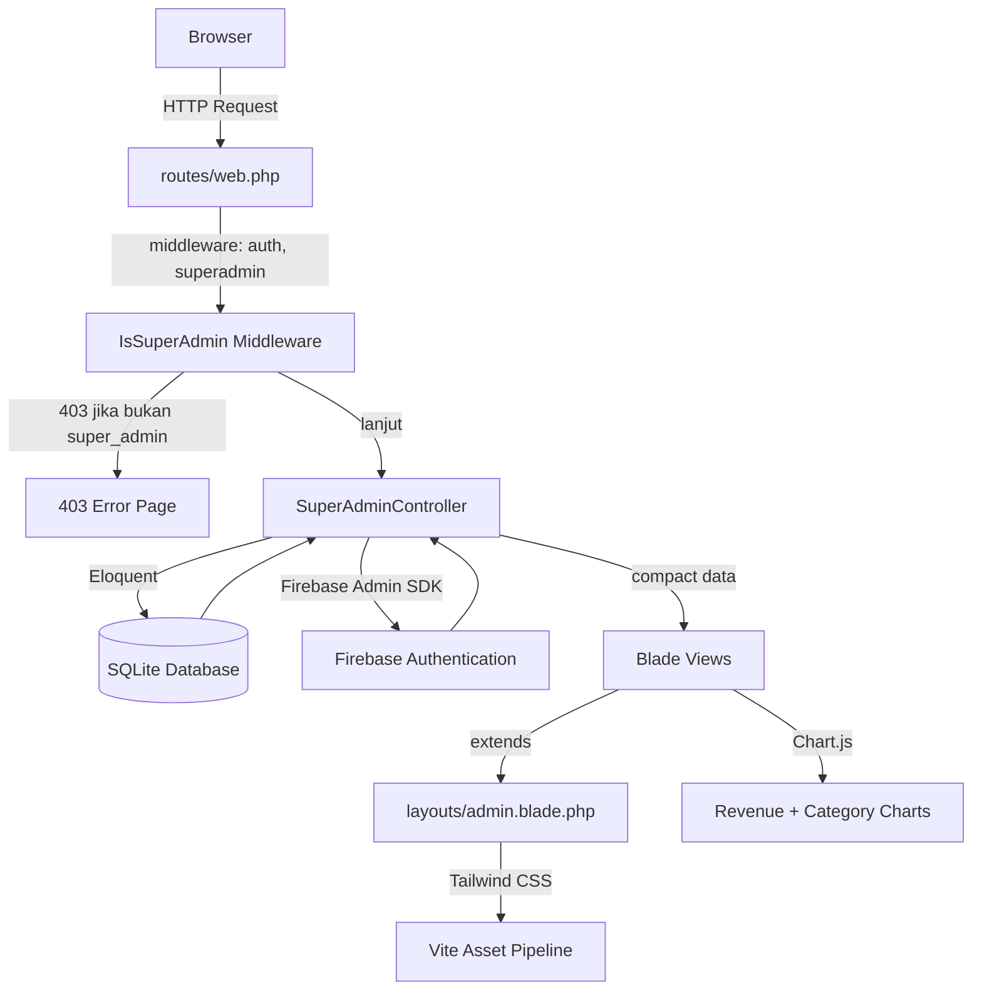

# Design Document: Admin Dashboard Redesign

## Overview

Redesign menyeluruh halaman admin Q-Les dari tampilan Bootstrap sederhana menjadi desain "AdminPro" yang modern menggunakan Tailwind CSS. Scope mencakup empat area utama: Blade layout utama (sidebar + header), halaman Dashboard (stats, charts, tables), halaman Manajemen Pengguna (lokal + Firebase Auth), dan halaman Customer Service (support tickets CRUD).

Stack yang digunakan: Laravel 12, Blade templating, Tailwind CSS via Vite, Chart.js untuk grafik, Firebase Admin SDK PHP untuk integrasi Firebase Authentication, dan SQLite sebagai database.

Semua halaman admin dilindungi oleh middleware `IsSuperAdmin` yang memverifikasi `role === 'super_admin'` pada user yang sedang login.

---

## Architecture

Arsitektur mengikuti pola MVC Laravel yang sudah ada, dengan penambahan layer view component untuk reusability.



### Alur Request Admin

1. Browser mengirim request ke route `/hq-admin/*`
2. Middleware `auth` memverifikasi sesi login — redirect ke `/login` jika tidak ada
3. Middleware `superadmin` (alias `IsSuperAdmin`) memverifikasi `role === 'super_admin'` — abort 403 jika tidak
4. `SuperAdminController` mengambil data dari SQLite via Eloquent dan/atau Firebase SDK
5. Data di-pass ke Blade view yang meng-extend `layouts/admin.blade.php`
6. Layout merender sidebar, header, dan konten halaman dengan Tailwind CSS

---

## Components and Interfaces

### 1. Blade Layout Utama (`resources/views/layouts/admin.blade.php`)

Layout induk yang diwarisi semua halaman admin. Mendefinisikan struktur HTML lengkap.

**Struktur:**
```
<html>
  <head> — Tailwind CSS via @vite, Chart.js CDN, meta tags </head>
  <body class="bg-gray-100">
    <div class="flex h-screen">
      <!-- Sidebar (lebar 240px, bg-navy-900) -->
      <aside class="w-60 bg-[#1e2a3a] flex-shrink-0">
        <!-- Logo -->
        <!-- Menu Utama: Dashboard, Pengguna, Pesanan, Laporan, Pengaturan -->
        <!-- Menu Lainnya: Pesan (badge), Notifikasi, Bantuan -->
        <!-- Keluar -->
      </aside>

      <!-- Main Content Area -->
      <div class="flex-1 flex flex-col overflow-hidden">
        <!-- Header (bg-white, shadow) -->
        <header class="bg-white shadow-sm h-16 flex items-center justify-between px-6">
          <!-- Judul halaman (kiri) -->
          <!-- Nama admin + avatar (kanan) -->
        </header>

        <!-- Page Content -->
        <main class="flex-1 overflow-y-auto p-6">
          @yield('content')
        </main>
      </div>
    </div>

    @stack('scripts')
  </body>
</html>
```

**Active State Logic:**
Menggunakan helper `request()->routeIs('admin.dashboard')` untuk menentukan item aktif. Item aktif mendapat class `bg-blue-600 text-white`, item non-aktif mendapat `text-gray-300 hover:bg-gray-700`.

**Blade Component:** `resources/views/components/admin/sidebar-item.blade.php` — komponen reusable untuk setiap item menu sidebar.

---

### 2. Dashboard Controller (`SuperAdminController@index`)

Method `index()` yang sudah ada di-refactor untuk menyediakan semua data yang dibutuhkan dashboard baru.

**Interface:**
```php
public function index(): View
{
    // Stats Cards
    $totalUsers = User::count();
    $totalSubmissions = Submission::count();
    $totalRevenue = 0; // placeholder, bisa dari tabel lain
    $totalProducts = 0; // placeholder

    // Orders Table (10 terbaru)
    $recentSubmissions = Submission::with('student')
        ->latest()
        ->take(10)
        ->get();

    // New Users List (5 terbaru)
    $newUsers = User::latest()->take(5)->get();

    // Revenue Chart Data (per bulan, 6 bulan terakhir)
    $revenueData = $this->getRevenueChartData();

    // Category Distribution Data
    $categoryData = $this->getCategoryChartData();

    return view('hq-admin.dashboard', compact(
        'totalUsers', 'totalSubmissions', 'totalRevenue', 'totalProducts',
        'recentSubmissions', 'newUsers', 'revenueData', 'categoryData'
    ));
}
```

---

### 3. User Management Controller (`SuperAdminController@users`)

```php
public function users(Request $request): View
{
    $search = $request->query('search', '');

    $users = User::when($search, function ($query, $search) {
            $query->where('name', 'like', "%{$search}%")
                  ->orWhere('email', 'like', "%{$search}%");
        })
        ->latest()
        ->paginate(20)
        ->withQueryString();

    $firebaseUsers = $this->getFirebaseUsers();

    return view('hq-admin.users', compact('users', 'firebaseUsers', 'search'));
}

private function getFirebaseUsers(): array
{
    try {
        $factory = (new Factory)->withServiceAccount(config('firebase.credentials'));
        $auth = $factory->createAuth();
        $users = $auth->listUsers(1000);

        return collect($users->iterateAll())->map(fn($u) => [
            'uid'           => $u->uid,
            'email'         => $u->email,
            'emailVerified' => $u->emailVerified,
        ])->toArray();
    } catch (\Exception $e) {
        return ['error' => 'Firebase tidak dapat dijangkau: ' . $e->getMessage(), 'data' => []];
    }
}
```

---

### 4. CS Page Controller (`SuperAdminController@serviceCenter` + `updateTicket`)

```php
public function serviceCenter(Request $request): View
{
    $status = $request->query('status', '');

    $tickets = SupportTicket::with('user')
        ->when($status, fn($q) => $q->where('status', $status))
        ->latest()
        ->paginate(15)
        ->withQueryString();

    return view('hq-admin.service-center', compact('tickets', 'status'));
}

public function updateTicket(Request $request, SupportTicket $ticket): RedirectResponse
{
    $validated = $request->validate([
        'status'      => 'required|in:open,in_progress,closed',
        'admin_reply' => 'nullable|string|max:2000',
    ]);

    $ticket->update($validated);

    AuditLog::record(
        auth()->id(),
        'UPDATE_TICKET',
        'support_tickets',
        $ticket->id,
        "Admin mengubah status tiket #{$ticket->id} menjadi {$validated['status']}"
    );

    return back()->with('success', 'Tiket berhasil diperbarui.');
}
```

---

### 5. Blade Views

| View File | Extends | Deskripsi |
|---|---|---|
| `resources/views/layouts/admin.blade.php` | — | Layout induk admin |
| `resources/views/hq-admin/dashboard.blade.php` | `layouts.admin` | Halaman dashboard utama |
| `resources/views/hq-admin/users.blade.php` | `layouts.admin` | Manajemen pengguna |
| `resources/views/hq-admin/service-center.blade.php` | `layouts.admin` | CS / support tickets |
| `resources/views/components/admin/sidebar-item.blade.php` | — | Komponen item sidebar |
| `resources/views/components/admin/stats-card.blade.php` | — | Komponen stats card |

---

## Data Models

### User (existing)

```php
// Kolom relevan untuk admin dashboard
id, name, email, role, firebase_uid, profile_picture, created_at
```

### Submission (existing)

```php
// Kolom relevan untuk orders table
id, student_id (FK → users), status, created_at
// Relasi: belongsTo User via student_id
```

### SupportTicket (perlu diupdate)

Migration yang ada saat ini hanya memiliki `id` dan `timestamps`. Perlu ditambahkan kolom lengkap:

```php
// Migration baru: add_columns_to_support_tickets_table
Schema::table('support_tickets', function (Blueprint $table) {
    $table->foreignId('user_id')->nullable()->constrained()->nullOnDelete();
    $table->string('subject');
    $table->text('message');
    $table->enum('status', ['open', 'in_progress', 'closed'])->default('open');
    $table->text('admin_reply')->nullable();
});
```

**Model SupportTicket (diupdate):**
```php
class SupportTicket extends Model
{
    protected $fillable = ['user_id', 'subject', 'message', 'status', 'admin_reply'];

    public function user(): BelongsTo
    {
        return $this->belongsTo(User::class);
    }
}
```

### AuditLog (existing)

```php
// Kolom: id, user_id, action, target_type, target_id, description, ip_address, timestamps
// Method statis: AuditLog::record($userId, $action, $targetType, $targetId, $description)
```

### Chart Data Structures

**Revenue Chart (line chart):**
```php
// Array untuk Chart.js
$revenueData = [
    'labels' => ['Jan', 'Feb', 'Mar', 'Apr', 'Mei', 'Jun'],
    'values' => [1200, 1900, 1500, 2100, 1800, 2400], // dari Submission::count per bulan
];
```

**Category Chart (donut chart):**
```php
// Distribusi berdasarkan role user
$categoryData = [
    'labels' => ['Siswa', 'Guru', 'Admin'],
    'values' => [User::where('role','student')->count(), ...],
];
```

---

## Correctness Properties

*A property is a characteristic or behavior that should hold true across all valid executions of a system — essentially, a formal statement about what the system should do. Properties serve as the bridge between human-readable specifications and machine-verifiable correctness guarantees.*

Fitur ini melibatkan logika bisnis yang bervariasi dengan input (middleware authorization, query filtering, pagination, audit logging, Firebase error handling) sehingga property-based testing relevan untuk layer logika tersebut. Library yang digunakan: **PHPUnit** dengan data providers sebagai pendekatan property-based testing di ekosistem Laravel/PHP (karena tidak ada library PBT mature seperti QuickCheck untuk PHP, kita menggunakan parameterized tests dengan banyak generated cases).

---

### Property 1: Akses tanpa autentikasi selalu redirect ke login

*For any* route admin (`/hq-admin/*`) yang diakses tanpa sesi login yang valid, response harus berupa redirect ke halaman login (HTTP 302 ke `/login`).

**Validates: Requirements 1.6, 7.2**

---

### Property 2: Akses dengan role non-super_admin selalu menghasilkan 403

*For any* user yang terautentikasi dengan role selain `super_admin` (misalnya `student`, `teacher`, atau role lain yang mungkin ada), akses ke route admin mana pun harus menghasilkan HTTP 403.

**Validates: Requirements 1.7, 7.3**

---

### Property 3: Active state sidebar sesuai dengan route aktif

*For any* route admin yang valid, ketika layout dirender, hanya item menu sidebar yang sesuai dengan route tersebut yang memiliki class aktif (highlight biru), dan semua item lainnya tidak memiliki class aktif.

**Validates: Requirements 1.3**

---

### Property 4: Header selalu menampilkan nama admin yang sedang login

*For any* user dengan role `super_admin` yang sedang login, header halaman admin harus menampilkan nama user tersebut (`auth()->user()->name`).

**Validates: Requirements 1.4**

---

### Property 5: Orders table dibatasi maksimal 10 entri terbaru

*For any* jumlah submissions N di database (N ≥ 0), tabel Orders di dashboard harus menampilkan tepat `min(N, 10)` entri, dan entri tersebut harus merupakan N submission terbaru berdasarkan `created_at` descending.

**Validates: Requirements 2.4**

---

### Property 6: New Users list dibatasi maksimal 5 entri terbaru

*For any* jumlah users N di database (N ≥ 0), daftar New Users di dashboard harus menampilkan tepat `min(N, 5)` entri, dan entri tersebut harus merupakan N user terbaru berdasarkan `created_at` descending.

**Validates: Requirements 2.5**

---

### Property 7: Pencarian user hanya mengembalikan hasil yang relevan

*For any* search query string Q dan kumpulan users di database, hasil pencarian harus hanya berisi users yang nama atau email-nya mengandung Q (case-insensitive). Tidak ada user yang tidak relevan yang boleh muncul dalam hasil.

**Validates: Requirements 3.2**

---

### Property 8: Penghapusan user selalu menghasilkan AuditLog entry

*For any* user yang berhasil dihapus oleh admin, harus ada tepat satu entry baru di tabel `audit_logs` dengan `action = 'DELETE_USER'` dan `target_id` yang sesuai dengan ID user yang dihapus.

**Validates: Requirements 3.5**

---

### Property 9: Firebase error handling tidak menyebabkan crash

*For any* jenis exception yang dilempar oleh Firebase Admin SDK (network timeout, invalid credentials, quota exceeded, dll.), method `getFirebaseUsers()` harus mengembalikan array dengan key `error` (string) dan `data` (array kosong), tanpa menyebabkan unhandled exception.

**Validates: Requirements 3.8, 4.3**

---

### Property 10: Firebase data selalu memiliki field uid, email, emailVerified

*For any* response valid dari Firebase Admin SDK yang berisi daftar akun, setiap item dalam koleksi yang dikembalikan oleh controller harus memiliki tepat tiga field: `uid` (string), `email` (string), dan `emailVerified` (boolean).

**Validates: Requirements 4.2, 3.7**

---

### Property 11: Filter status tiket hanya mengembalikan tiket dengan status yang diminta

*For any* nilai status filter yang valid (`open`, `in_progress`, `closed`) dan kumpulan tickets di database, hasil query harus hanya berisi tickets dengan status yang sama persis dengan filter yang diberikan.

**Validates: Requirements 5.3**

---

### Property 12: Update tiket selalu menghasilkan AuditLog entry

*For any* support ticket yang berhasil diupdate oleh admin (perubahan status dan/atau admin_reply), harus ada tepat satu entry baru di tabel `audit_logs` dengan `action = 'UPDATE_TICKET'` dan `target_id` yang sesuai dengan ID tiket yang diupdate.

**Validates: Requirements 5.6**

---

### Property 13: Cascade nullify pada penghapusan user

*For any* user yang memiliki satu atau lebih support tickets, ketika user tersebut dihapus dari database, semua tickets yang dimilikinya harus memiliki `user_id = null` (bukan dihapus, bukan error referential integrity).

**Validates: Requirements 6.5**

---

### Property 14: Input validasi menolak semua input tidak valid

*For any* request ke endpoint update tiket dengan nilai `status` yang tidak termasuk dalam enum (`open`, `in_progress`, `closed`), atau `admin_reply` yang melebihi 2000 karakter, controller harus mengembalikan response dengan HTTP 422 (Unprocessable Entity) dan pesan validasi yang sesuai.

**Validates: Requirements 7.4, 7.5**

---

## Error Handling

### Firebase SDK Failures

Firebase SDK dapat gagal karena berbagai alasan. Semua kegagalan ditangani di `getFirebaseUsers()` dengan try-catch:

```php
try {
    // ... Firebase call
} catch (\Kreait\Firebase\Exception\AuthException $e) {
    return ['error' => 'Firebase Auth error: ' . $e->getMessage(), 'data' => []];
} catch (\Kreait\Firebase\Exception\FirebaseException $e) {
    return ['error' => 'Firebase tidak dapat dijangkau.', 'data' => []];
} catch (\Exception $e) {
    return ['error' => 'Terjadi kesalahan tidak terduga.', 'data' => []];
}
```

Di view, kondisi error ditampilkan sebagai alert informatif:
```blade
@if(isset($firebaseUsers['error']))
    <div class="bg-red-50 border border-red-200 text-red-700 px-4 py-3 rounded">
        ⚠️ {{ $firebaseUsers['error'] }}
    </div>
@endif
```

### Empty States

Semua tabel dan list harus menangani kondisi data kosong:
- Stats cards: default ke `0` jika query mengembalikan null
- Orders table: tampilkan baris "Belum ada data submission." jika kosong
- New Users list: tampilkan "Belum ada pengguna terdaftar." jika kosong
- CS Page: tampilkan "Tidak ada tiket saat ini." jika kosong (Requirement 5.7)

### Validasi Input

Semua form input divalidasi menggunakan `$request->validate()`:

```php
// Update ticket
$validated = $request->validate([
    'status'      => 'required|in:open,in_progress,closed',
    'admin_reply' => 'nullable|string|max:2000',
]);

// Search query (sanitized via Eloquent binding, tidak perlu validasi eksplisit)
$search = $request->query('search', '');
// Eloquent `like` query menggunakan PDO prepared statements — aman dari SQL injection
```

### HTTP 403 Handling

Middleware `IsSuperAdmin` memanggil `abort(403, 'Akses Ditolak!')`. Laravel secara otomatis merender halaman error 403. Bisa dikustomisasi dengan `resources/views/errors/403.blade.php`.

---

## Testing Strategy

### Pendekatan Dual Testing

Strategi testing menggunakan dua pendekatan komplementer:

1. **Unit/Feature Tests** (PHPUnit + Laravel TestCase): untuk contoh spesifik, edge cases, dan integrasi antar komponen
2. **Parameterized Tests** (PHPUnit data providers dengan banyak generated cases): untuk memverifikasi properties universal

### Unit & Feature Tests

**Middleware Tests:**
- Test redirect ke login untuk unauthenticated request ke setiap route admin
- Test HTTP 403 untuk user dengan role `student`, `teacher`, dll.
- Test akses berhasil untuk user dengan role `super_admin`

**Dashboard Tests:**
- Test `index()` mengembalikan semua variabel yang dibutuhkan view
- Test stats cards menampilkan `0` ketika database kosong
- Test orders table menampilkan data yang benar

**User Management Tests:**
- Test pencarian dengan query yang match dan tidak match
- Test paginasi (20 per halaman)
- Test `destroyUser()` menghapus user dan membuat AuditLog
- Test `getFirebaseUsers()` dengan mock Firebase SDK (sukses dan gagal)

**CS Page Tests:**
- Test filter status mengembalikan hanya tiket dengan status yang diminta
- Test `updateTicket()` menyimpan perubahan dan membuat AuditLog
- Test empty state ketika tidak ada tiket

**Model Tests:**
- Test relasi `SupportTicket::user()` mengembalikan user yang benar
- Test cascade nullify ketika user dihapus

### Property-Based Tests (Parameterized)

Setiap property di atas diimplementasikan sebagai PHPUnit test dengan data provider yang menghasilkan banyak variasi input. Minimum 100 iterasi per property.

Tag format: `/** @group Feature:admin-dashboard-redesign, Property N: <property_text> */`

**Contoh implementasi Property 7 (pencarian user):**
```php
/**
 * @group Feature:admin-dashboard-redesign, Property 7: Pencarian user hanya mengembalikan hasil yang relevan
 * @dataProvider searchQueryProvider
 */
public function test_search_returns_only_relevant_users(string $query, array $userNames): void
{
    // Buat users dengan nama dari $userNames
    foreach ($userNames as $name) {
        User::factory()->create(['name' => $name, 'role' => 'student']);
    }

    $response = $this->actingAs($this->superAdmin)
        ->get(route('admin.users', ['search' => $query]));

    $response->assertOk();
    // Verifikasi semua hasil mengandung query
    $viewUsers = $response->viewData('users');
    foreach ($viewUsers as $user) {
        $this->assertTrue(
            str_contains(strtolower($user->name), strtolower($query)) ||
            str_contains(strtolower($user->email), strtolower($query))
        );
    }
}

public static function searchQueryProvider(): array
{
    // 100+ kombinasi query dan data
    return [
        ['budi', ['Budi Santoso', 'Andi Wijaya', 'Siti Rahayu']],
        ['@gmail', ['user1@gmail.com', 'user2@yahoo.com']],
        // ... lebih banyak cases
    ];
}
```

**Contoh implementasi Property 2 (403 untuk non-super_admin):**
```php
/**
 * @group Feature:admin-dashboard-redesign, Property 2: Akses dengan role non-super_admin selalu 403
 * @dataProvider nonAdminRoleProvider
 */
public function test_non_super_admin_gets_403(string $role, string $route): void
{
    $user = User::factory()->create(['role' => $role]);

    $this->actingAs($user)
        ->get(route($route))
        ->assertStatus(403);
}

public static function nonAdminRoleProvider(): array
{
    $roles = ['student', 'teacher', 'moderator', 'guest'];
    $routes = ['admin.dashboard', 'admin.users', 'admin.service'];
    $cases = [];
    foreach ($roles as $role) {
        foreach ($routes as $route) {
            $cases["{$role}_{$route}"] = [$role, $route];
        }
    }
    return $cases; // 12 kombinasi
}
```

### Integration Tests

- Test Firebase SDK dipanggil dengan parameter `maxResults = 1000` (mock HTTP)
- Test AuditLog dibuat dengan field yang benar setelah operasi admin
- Test migration `support_tickets` membuat semua kolom yang diperlukan

### Test Configuration

```xml
<!-- phpunit.xml — group untuk admin dashboard tests -->
<testsuite name="AdminDashboard">
    <directory>tests/Feature/Admin</directory>
</testsuite>
```

Jalankan tests:
```bash
php artisan test --testsuite=AdminDashboard
```
